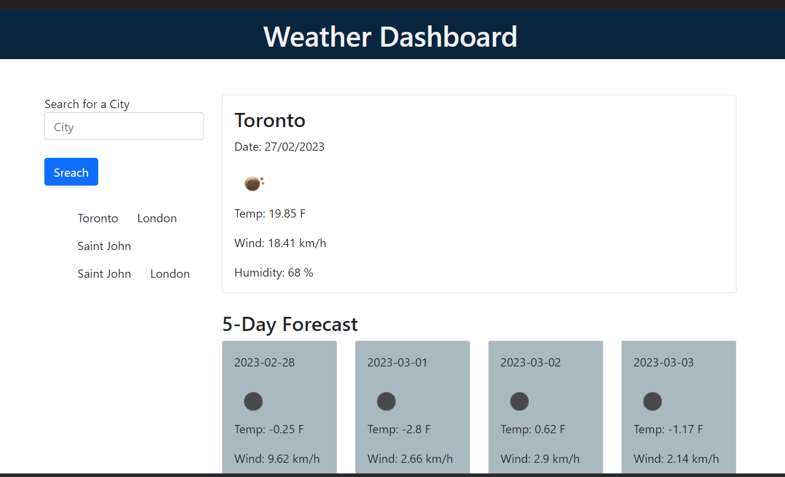
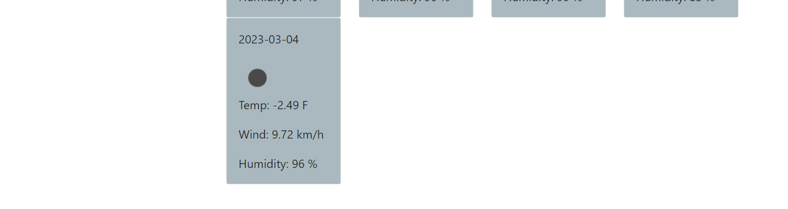

# week6-Weather-Dashboard

## Description
In this task, I built an application that users can check the weather for many cities. In the Dashboard, users can see the current weather and the future conditions for the next five days, and the weather conditions include the city names, the date, the temperature, the humidity, and the wind speed. In addition, users can click the search history to chek the weather quickly. 

## Screenshots

## Links

The URL of the functional, deployed application: https://jiasisi.github.io/week6-Weather-Dashboard/

The URL of the GitHub repository: https://github.com/Jiasisi/week6-Weather-Dashboard